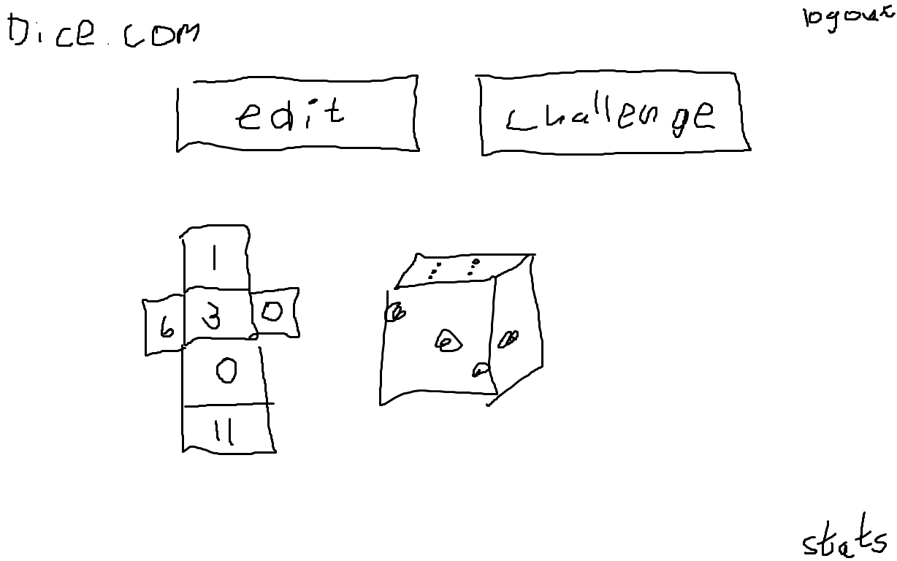
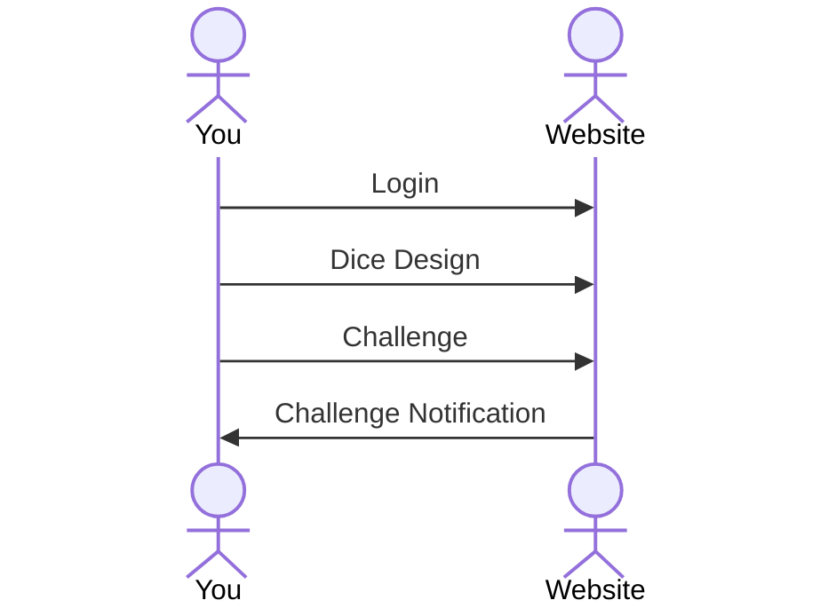

# Weighted Dice

[My Notes](notes.md)

This is a website where users can make custom dice and roll them against each other.

## 🚀 Specification Deliverable

For this deliverable I did the following. I checked the box `[x]` and added a description for things I completed.

- [X] Proper use of Markdown
- [X] A concise and compelling elevator pitch
- [X] Description of key features
- [X] Description of how you will use each technology
- [X] One or more rough sketches of your application. Images must be embedded in this file using Markdown image references.

### Elevator pitch

Users will be able to make custom dice and roll them against each other. Each user will have 21 pips to distribute among 6 faces.

The goal is to have users try to find the best dice to beat their peers. Users can choose which die to roll against, and their win/loss/draw ratio will be tracked. Both users do not need to be online in order for a match to be made: an online user will pull a different user's die from the database.

### Design

This is a (very) rough sketch of what the site will look like. Your dice and it's net are displayed, with the two most important buttons being front and center.

```mermaid
sequenceDiagram
    actor You
    actor Website
    You->>Website: Login
    You->>Website: Dice Design
    You->>Website: Challenge
    Website->>You: Challenge Notification
```

### Key features

- Dice customization menu
- Challenge menu (to roll against other existing dice)
- Dice gallery
- Win/Loss/Draw ratio display for different users

### Technologies

I am going to use the required technologies in the following ways.

- **HTML** - Basic structure
- **CSS** - Advanced graphics
- **React** - Login functionality, Dice editing
- **Service** - Accessing database and creating matches
- **DB/Login** - Storing users' dice data
- **WebSocket** - Showing recent matches, notification if your dice is rolled against

## 🚀 AWS deliverable

For this deliverable I did the following. I checked the box `[x]` and added a description for things I completed.

- [X] **Server deployed and accessible with custom domain name** - [My server link](https://weighteddice.click).

## 🚀 HTML deliverable

For this deliverable I did the following. I checked the box `[x]` and added a description for things I completed.

- [X] **HTML pages** - Main, About, and Leaderboard are separate pages
- [X] **Proper HTML element usage** - Usage of header, footer, aside, br, img, etc
- [X] **Links** - both internal links (between pages) and an external link (to wikipedia)
- [X] **Text** - About page, button labels
- [X] **3rd party API placeholder** - random.org will be used for randomness
- [X] **Images** - icon image on tab, dice image on about page
- [X] **Login placeholder** - top left of main page
- [X] **DB data placeholder** - leaderboards and dice storage
- [X] **WebSocket placeholder** - notification panel on main page

## 🚀 CSS deliverable

For this deliverable I did the following. I checked the box `[x]` and added a description for things I completed.

- [X] **Visually appealing colors and layout. No overflowing elements.** - Consistent color scheme, things are contained
- [X] **Use of a CSS framework** - Installed Bootstrap
- [X] **All visual elements styled using CSS** - Everything looks better
- [X] **Responsive to window resizing using flexbox and/or grid display** - things wrap and change size dynamically
- [X] **Use of a imported font** - Imported Roboto
- [X] **Use of different types of selectors including element, class, ID, and pseudo selectors** - SO many classes. like all of them. also hover

## 🚀 React part 1: Routing deliverable

For this deliverable I did the following. I checked the box `[x]` and added a description for things I completed.

- [X] **Bundled using Vite** - done
- [X] **Components** - done
- [X] **Router** - done

## 🚀 React part 2: Reactivity deliverable

For this deliverable I did the following. I checked the box `[x]` and added a description for things I completed.

- [X] **All functionality implemented or mocked out** - indeed it now is
- [X] **Hooks** - Joke button on about page

## 🚀 Service deliverable

For this deliverable I did the following. I checked the box `[x]` and added a description for things I completed.

- [ ] **Node.js/Express HTTP service** - I did not complete this part of the deliverable.
- [ ] **Static middleware for frontend** - I did not complete this part of the deliverable.
- [ ] **Calls to third party endpoints** - I did not complete this part of the deliverable.
- [ ] **Backend service endpoints** - I did not complete this part of the deliverable.
- [ ] **Frontend calls service endpoints** - I did not complete this part of the deliverable.
- [ ] **Supports registration, login, logout, and restricted endpoint** - I did not complete this part of the deliverable.

## 🚀 DB deliverable

For this deliverable I did the following. I checked the box `[x]` and added a description for things I completed.

- [ ] **Stores data in MongoDB** - I did not complete this part of the deliverable.
- [ ] **Stores credentials in MongoDB** - I did not complete this part of the deliverable.

## 🚀 WebSocket deliverable

For this deliverable I did the following. I checked the box `[x]` and added a description for things I completed.

- [ ] **Backend listens for WebSocket connection** - I did not complete this part of the deliverable.
- [ ] **Frontend makes WebSocket connection** - I did not complete this part of the deliverable.
- [ ] **Data sent over WebSocket connection** - I did not complete this part of the deliverable.
- [ ] **WebSocket data displayed** - I did not complete this part of the deliverable.
- [ ] **Application is fully functional** - I did not complete this part of the deliverable.
